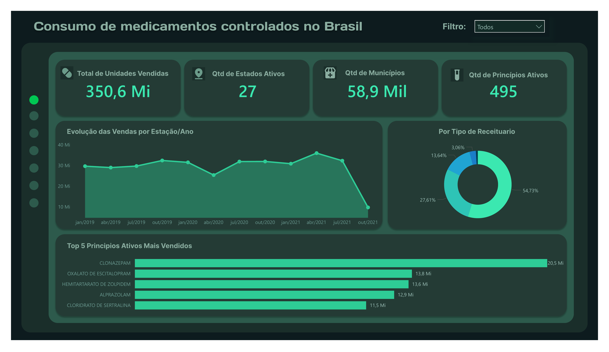
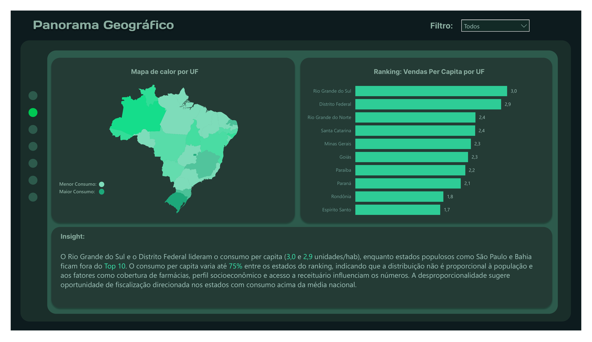
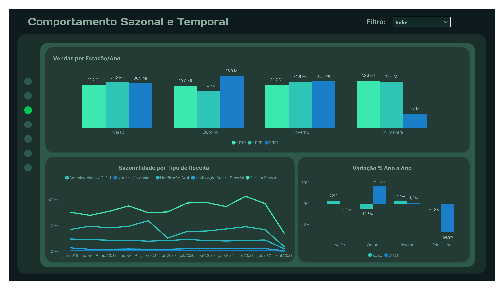
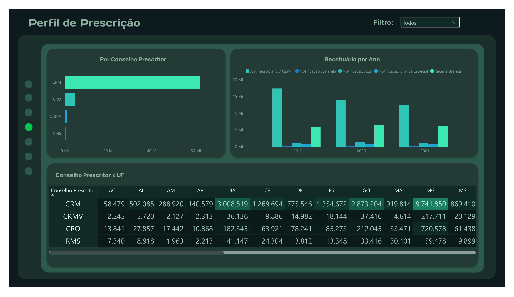
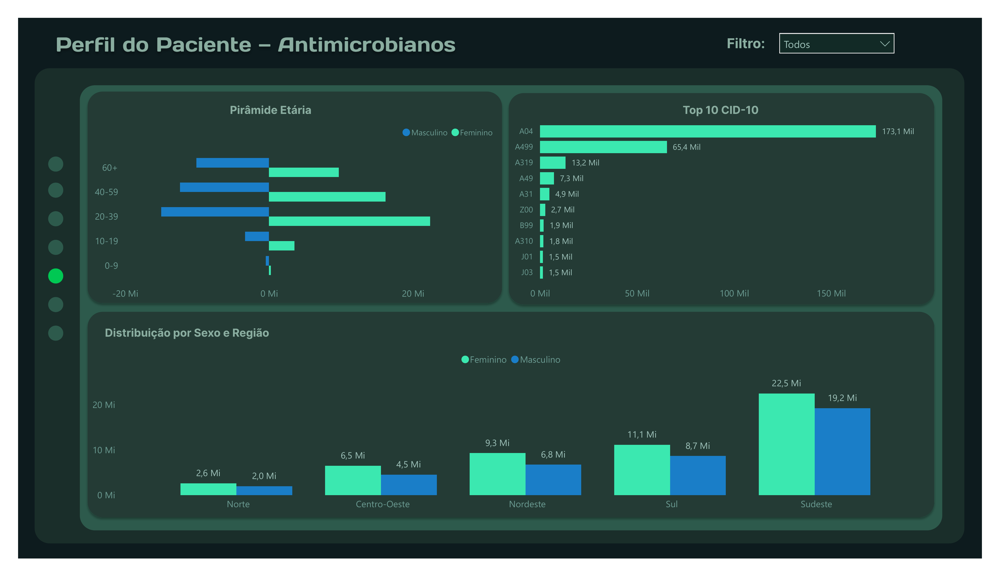
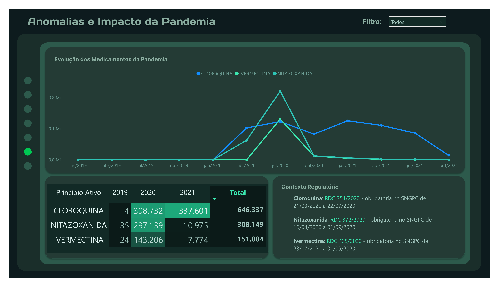
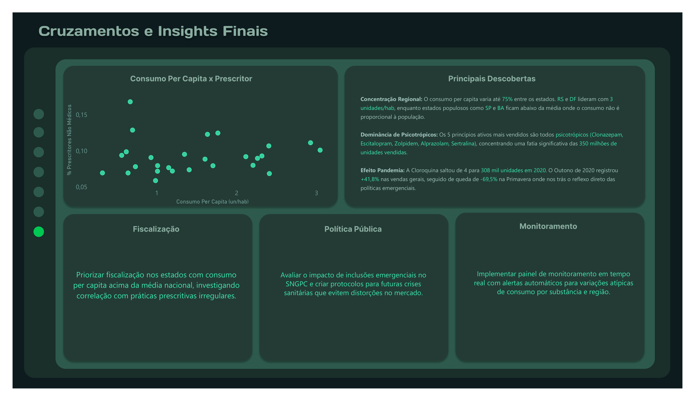

# 💊 Análise do Consumo de Medicamentos Controlados no Brasil

### Dados Abertos ANVISA — SNGPC (2019–2021)

Dashboard interativo de 7 páginas no Power BI analisando **68 milhões de registros** de vendas de medicamentos controlados e antimicrobianos no Brasil.



---

## 📋 Sobre o Projeto

O Sistema Nacional de Gerenciamento de Produtos Controlados (SNGPC) da ANVISA coleta dados de vendas de medicamentos controlados de farmácias e drogarias privadas em todo o território nacional. Este projeto utiliza esses dados abertos para responder à pergunta:

> **"Como o Brasil consome medicamentos controlados, e o que os dados revelam sobre padrões, riscos e oportunidades de fiscalização?"**

### Escopo da Análise
- **12 meses estratégicos** (jan/abr/jul/out de 2019, 2020 e 2021) — 1 mês por estação do ano
- **68 milhões de linhas** importadas e processadas no PostgreSQL
- **7 tabelas agregadas** exportadas para o Power BI
- **3 tabelas dimensão** auxiliares (População IBGE, Estações, Receituários)

---

## 🔍 Principais Descobertas

| Descoberta | Detalhe |
|---|---|
| **Psicotrópicos dominam** | Os 5 princípios ativos mais vendidos são todos psicotrópicos — Clonazepam lidera com 20,5 Mi de unidades |
| **Desigualdade regional** | O consumo per capita varia até 75% entre estados — RS e DF lideram, SP e BA ficam fora do Top 10 |
| **Impacto da pandemia** | Cloroquina saltou de 4 para 308 mil unidades em 2020 (aumento de 77.000x) |
| **Sazonalidade atípica** | Outono de 2020 registrou +41,8% nas vendas gerais; Primavera despencou -69,5% |
| **Perfil de gênero** | Mulheres consomem mais antimicrobianos que homens em todas as faixas etárias |

---

## 📊 Páginas do Dashboard

| Página | Título | Descrição |
|---|---|---|
| 1 | Resumo Executivo | KPIs gerais, tendência temporal, top 5 princípios ativos, distribuição por receituário |
| 2 | Panorama Geográfico | Mapa de calor por UF, ranking de consumo per capita, insight analítico |
| 3 | Comportamento Sazonal | Vendas por estação/ano, sazonalidade por receita, variação % YoY |
| 4 | Perfil de Prescrição | Distribuição por conselho prescritor, receituário por ano, matrix conselho x UF |
| 5 | Perfil do Paciente | Pirâmide etária, top 10 CID-10, distribuição por sexo e região |
| 6 | Anomalias e Pandemia | Evolução Cloroquina/Ivermectina/Nitazoxanida, matrix comparativa, contexto regulatório |
| 7 | Insights Finais | Dispersão consumo vs prescritores não-médicos, insights e recomendações |

### Preview das Páginas

<details>
<summary>📸 Clique para ver todas as páginas</summary>

#### Página 1 — Resumo Executivo


#### Página 2 — Panorama Geográfico


#### Página 3 — Comportamento Sazonal


#### Página 4 — Perfil de Prescrição


#### Página 5 — Perfil do Paciente


#### Página 6 — Anomalias e Pandemia


#### Página 7 — Insights Finais


</details>

---

## 🛠️ Ferramentas e Tecnologias

| Ferramenta | Uso no Projeto |
|---|---|
| **PostgreSQL** (DBeaver) | Importação dos CSVs brutos (~820MB cada), limpeza, transformação e agregação via SQL |
| **Excel** | Criação de tabelas auxiliares: população IBGE, estações do ano, receituários |
| **Power BI** | Modelagem de dados, medidas DAX, construção do dashboard de 7 páginas |
| **Figma** | Design dos backgrounds customizados (tema verde farmacêutico escuro) |

---

## 🗃️ Estrutura do Repositório

```
anvisa-sngpc-dashboard/
│
├── README.md
├── assets/                          # Screenshots das páginas do dashboard
│   ├── 01_resumo_executivo.png
│   ├── 02_panorama_geografico.png
│   ├── 03_comportamento_sazonal.png
│   ├── 04_perfil_prescricao.png
│   ├── 05_perfil_paciente.png
│   ├── 06_anomalias_pandemia.png
│   └── 07_insights_finais.png
│
├── docs/                            # Documentação do projeto
│   ├── Escopo_Projeto_ANVISA_SNGPC_v3.docx
│   └── Storyboard_Dashboard_ANVISA_v3.docx
│
├── sql/                             # Queries SQL utilizadas
│   ├── 01_criar_tabela.sql
│   ├── 02_importacao_csv.sql
│   ├── 03_bloco1_geografico.sql
│   ├── 04_bloco2_temporal.sql
│   ├── 05_bloco3_prescricao.sql
│   ├── 06_bloco4_paciente.sql
│   ├── 07_bloco5_anomalias.sql
│   └── 08_bloco6_cruzamentos.sql
│
├── dashboard/                       # Arquivo do Power BI
│   └── Dashboard_ANVISA.pbix
│
└── auxiliar/                        # Tabelas auxiliares Excel
    ├── dim_populacao_ibge.xlsx
    ├── dim_estacoes.xlsx
    └── dim_receituarios_v2.xlsx
```

---

## 📐 Modelo de Dados

```
                    ┌──────────┐
                    │ dim_Ano  │
                    │   Ano    │
                    └────┬─────┘
                         │ 1:*
        ┌────────────────┼────────────────┐
        │                │                │
  ┌─────┴──────┐  ┌──────┴───────┐  ┌────┴──────────┐
  │ Vendas UF  │  │Vendas Tempor.│  │  Anomalias    │
  │            │  │              │  │  Pandemia     │
  └─────┬──────┘  └──────────────┘  └───────────────┘
        │ *:1
  ┌─────┴──────┐
  │População UF│
  │  (IBGE)    │
  └────────────┘
```

A tabela `dim_Ano` centraliza o filtro global, permitindo que o segmentador de Ano filtre todas as tabelas fato simultaneamente.

---

## 🗄️ Pipeline SQL

O processamento dos dados brutos seguiu 8 etapas no PostgreSQL:

| Arquivo | Etapa | Descrição |
|---|---|---|
| `01_criar_tabela.sql` | Estrutura | Criação da tabela `vendas_medicamentos` com 15 campos (ano, mês, UF, princípio ativo, etc.) |
| `02_importacao_csv.sql` | Ingestão | Importação dos 12 CSVs via `COPY` (encoding win1252, delimitador `;`) + criação de índices |
| `03_bloco1_geografico.sql` | Agregação | `agg_vendas_uf` — vendas agrupadas por UF, ano e mês |
| `04_bloco2_temporal.sql` | Agregação | `agg_vendas_temporal` — vendas por período e tipo de receituário |
| `05_bloco3_prescricao.sql` | Agregação | `agg_prescricao` — prescrições por conselho, receituário e UF |
| `06_bloco4_paciente.sql` | Agregação | `agg_paciente_antimicrobiano` — perfil demográfico filtrado por `tipo_receituario = '5.'` |
| `07_bloco5_anomalias.sql` | Agregação | `agg_anomalias_pandemia` — Cloroquina, Ivermectina e Nitazoxanida via `LIKE` |
| `08_bloco6_cruzamentos.sql` | Cruzamento | `agg_cruzamento_uf` — métricas cruzadas por UF incluindo registros não-médicos |

**Fluxo:** 12 CSVs (~820MB cada) → 1 tabela bruta (68Mi linhas) → 7 tabelas agregadas (centenas de linhas) → Power BI

---

## 📈 Medidas DAX Principais

**Consumo Per Capita**
```dax
Consumo Per Capita = 
DIVIDE(
    SUM('Vendas UF'[Qtd Total Vendida]),
    SUM('População UF'[População 2021]),
    0
)
```

**Variação % Year-over-Year**
```dax
Vendas Ano Anterior = 
CALCULATE(
    SUM('Vendas Temporal'[Qtd Total Vendas]),
    FILTER(
        ALL(dim_Ano[Ano]),
        VALUE(dim_Ano[Ano]) = VALUE(MAX(dim_Ano[Ano])) - 1
    )
)

Variação % YoY = 
DIVIDE(
    SUM('Vendas Temporal'[Qtd Total Vendas]) - [Vendas Ano Anterior],
    [Vendas Ano Anterior],
    0
)
```

**% Prescritores Não Médicos**
```dax
% Prescritores Não Médicos = 
DIVIDE(
    SUM('Cruzamento UF'[Registros Não Médicos]),
    SUM('Cruzamento UF'[Total Registros]),
    0
)
```

---

## 📝 Contexto Regulatório (Pandemia)

| Substância | RDC | Período no SNGPC |
|---|---|---|
| Cloroquina | RDC 351/2020 | 21/03/2020 a 22/07/2020 |
| Nitazoxanida | RDC 372/2020 | 16/04/2020 a 01/09/2020 |
| Ivermectina | RDC 405/2020 | 23/07/2020 a 01/09/2020 |

As três substâncias foram incluídas no controle do SNGPC durante a pandemia e tiveram suas exigências revogadas após set/2020.

---

## 🎯 Recomendações Baseadas nos Dados

1. **Fiscalização Direcionada** — Priorizar estados com consumo per capita acima da média nacional
2. **Política Pública** — Criar protocolos para inclusões emergenciais no SNGPC em futuras crises sanitárias
3. **Monitoramento Contínuo** — Implementar alertas automáticos para variações atípicas de consumo

---

## 📂 Fonte dos Dados

- **Origem:** [Portal de Dados Abertos — ANVISA/SNGPC](https://dados.gov.br/dados/conjuntos-dados/venda-de-medicamentos-controlados-e-antimicrobianos---medicamentos-industrializados)
- **Período:** Janeiro, Abril, Julho e Outubro de 2019, 2020 e 2021
- **Volume:** ~68 milhões de registros (12 arquivos CSV, ~820MB cada)

---

## 👤 Autor

**Lucas Fontes**

[](https://www.linkedin.com/in/SEU-PERFIL/)

---

*Projeto desenvolvido em Abril/2026 como parte do portfólio de Análise de Dados.*
